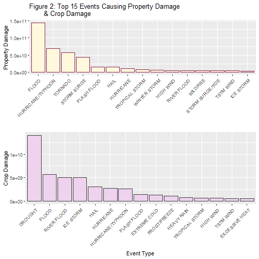

## Storm Data Research
### Synopsis: The basic goal of this assignment is to explore the NOAA Storm Database and answer some basic questions about severe weather events. I've created an R Markdown file that will explain and graphically display the answers to the following questions: 1. Across the US, which types of events are most harmful with respect to population health, and 2. Across the US, which types of events have the greatest economic consequences?

<!-- rmarkdown v1 -->


# 
# Load the data. 
# 

```r
if (!file.exists("data")) {
  dir.create("data")
}

fileUrl <- "https://d396qusza40orc.cloudfront.net/repdata%2Fdata%2FStormData.csv.bz2" ##testdata
download.file(fileUrl,destfile="./data/repdata_data_StormData.csv.bz2")
```

# 
# Read the data.
# 

```r
fStorm <- read.csv(bzfile("data/repdata_data_StormData.csv.bz2"),sep=",",header=TRUE)
```

# 
# Convert date
# 

```r
beginDate <- substr(fStorm$BGN_DATE,1,unlist(gregexpr(pattern=" ",fStorm$BGN_DATE))-1)
beginDate <- as.Date(beginDate,format="%m/%d/%Y")
```
# 
# setup and bind dataframe
# 

```r
fStorm <- cbind(fStorm,beginDate)
```
# 
# Results: Data for total fatalities
# 

```r
fatalities <- subset(fStorm,fStorm$FATALITIES > 0,select=c("EVTYPE","FATALITIES"))
#consolidate
fatalities <- aggregate(FATALITIES~EVTYPE,fatalities,FUN=sum)
#sort by. desc
fatalities <- fatalities[order(-fatalities[,2]),]
fatalities <- head(fatalities,15)
print(fatalities)
```

```
##                EVTYPE FATALITIES
## 141           TORNADO       5633
## 26     EXCESSIVE HEAT       1903
## 35        FLASH FLOOD        978
## 57               HEAT        937
## 97          LIGHTNING        816
## 145         TSTM WIND        504
## 40              FLOOD        470
## 116       RIP CURRENT        368
## 75          HIGH WIND        248
## 2           AVALANCHE        224
## 163      WINTER STORM        206
## 117      RIP CURRENTS        204
## 58          HEAT WAVE        172
## 30       EXTREME COLD        160
## 136 THUNDERSTORM WIND        133
```

```r
#calc. total fatalities
totalFatalities <- sum(fatalities$FATALITIES)
print(c("Total Fatalities:",toString(totalFatalities)))
```

```
## [1] "Total Fatalities:" "12956"
```
# 
# Results: Data for total injuries
# 

```r
injuries <- subset(fStorm,fStorm$INJURIES > 0,select=c("EVTYPE","INJURIES"))
#consolidate
injuries <- aggregate(INJURIES~EVTYPE,injuries,FUN=sum)
#sort by desc.
injuries <- injuries[order(-injuries[,2]),]
injuries <- head(injuries,15)
print(injuries)
```

```
##                EVTYPE INJURIES
## 129           TORNADO    91346
## 135         TSTM WIND     6957
## 30              FLOOD     6789
## 20     EXCESSIVE HEAT     6525
## 85          LIGHTNING     5230
## 47               HEAT     2100
## 79          ICE STORM     1975
## 28        FLASH FLOOD     1777
## 121 THUNDERSTORM WIND     1488
## 45               HAIL     1361
## 152      WINTER STORM     1321
## 76  HURRICANE/TYPHOON     1275
## 63          HIGH WIND     1137
## 53         HEAVY SNOW     1021
## 149          WILDFIRE      911
```

```r
#calc. total injuries
totalInjuries <- sum(injuries$INJURIES)
print(c("Total Injuries:",toString(totalInjuries)))
```

```
## [1] "Total Injuries:" "131213"
```

# 
# Total events per year
# 

```r
library(data.table)

eventsPerYear <- table(year(beginDate))
data.table(eventsPerYear)
```

```
##       V1     N
##  1: 1950   223
##  2: 1951   269
##  3: 1952   272
##  4: 1953   492
##  5: 1954   609
##  6: 1955  1413
##  7: 1956  1703
##  8: 1957  2184
##  9: 1958  2213
## 10: 1959  1813
## 11: 1960  1945
## 12: 1961  2246
## 13: 1962  2389
## 14: 1963  1968
## 15: 1964  2348
## 16: 1965  2855
## 17: 1966  2388
## 18: 1967  2688
## 19: 1968  3312
## 20: 1969  2926
## 21: 1970  3215
## 22: 1971  3471
## 23: 1972  2168
## 24: 1973  4463
## 25: 1974  5386
## 26: 1975  4975
## 27: 1976  3768
## 28: 1977  3728
## 29: 1978  3657
## 30: 1979  4279
## 31: 1980  6146
## 32: 1981  4517
## 33: 1982  7132
## 34: 1983  8322
## 35: 1984  7335
## 36: 1985  7979
## 37: 1986  8726
## 38: 1987  7367
## 39: 1988  7257
## 40: 1989 10410
## 41: 1990 10946
## 42: 1991 12522
## 43: 1992 13534
## 44: 1993 12607
## 45: 1994 20631
## 46: 1995 27970
## 47: 1996 32270
## 48: 1997 28680
## 49: 1998 38128
## 50: 1999 31289
## 51: 2000 34471
## 52: 2001 34962
## 53: 2002 36293
## 54: 2003 39752
## 55: 2004 39363
## 56: 2005 39184
## 57: 2006 44034
## 58: 2007 43289
## 59: 2008 55663
## 60: 2009 45817
## 61: 2010 48161
## 62: 2011 62174
##       V1     N
```
# 
# get rid of white space.
# 

```r
trimBgn  <- function (x) sub("^\\s+","",x)
trimEnd <- function (x) sub("\\s+$","",x)
trim <- function (x) gsub("^\\s+|\\s+$","",x)

EVT <- sort(unique(trimBgn(fStorm$EVTYPE)))
head(EVT,50)
```

```
##  [1] "?"                              "ABNORMAL WARMTH"               
##  [3] "ABNORMALLY DRY"                 "ABNORMALLY WET"                
##  [5] "ACCUMULATED SNOWFALL"           "AGRICULTURAL FREEZE"           
##  [7] "APACHE COUNTY"                  "ASTRONOMICAL HIGH TIDE"        
##  [9] "ASTRONOMICAL LOW TIDE"          "AVALANCE"                      
## [11] "AVALANCHE"                      "BEACH EROSIN"                  
## [13] "Beach Erosion"                  "BEACH EROSION"                 
## [15] "BEACH EROSION/COASTAL FLOOD"    "BEACH FLOOD"                   
## [17] "BELOW NORMAL PRECIPITATION"     "BITTER WIND CHILL"             
## [19] "BITTER WIND CHILL TEMPERATURES" "Black Ice"                     
## [21] "BLACK ICE"                      "BLIZZARD"                      
## [23] "BLIZZARD AND EXTREME WIND CHIL" "BLIZZARD AND HEAVY SNOW"       
## [25] "Blizzard Summary"               "BLIZZARD WEATHER"              
## [27] "BLIZZARD/FREEZING RAIN"         "BLIZZARD/HEAVY SNOW"           
## [29] "BLIZZARD/HIGH WIND"             "BLIZZARD/WINTER STORM"         
## [31] "BLOW-OUT TIDE"                  "BLOW-OUT TIDES"                
## [33] "BLOWING DUST"                   "blowing snow"                  
## [35] "Blowing Snow"                   "BLOWING SNOW"                  
## [37] "BLOWING SNOW- EXTREME WIND CHI" "BLOWING SNOW & EXTREME WIND CH"
## [39] "BLOWING SNOW/EXTREME WIND CHIL" "BREAKUP FLOODING"              
## [41] "BRUSH FIRE"                     "BRUSH FIRES"                   
## [43] "COASTAL  FLOODING/EROSION"      "COASTAL EROSION"               
## [45] "Coastal Flood"                  "COASTAL FLOOD"                 
## [47] "coastal flooding"               "Coastal Flooding"              
## [49] "COASTAL FLOODING"               "COASTAL FLOODING/EROSION"
```

```r
print(unique(fStorm$PROPDMGEXP))
```

```
##  [1] K M   B m + 0 5 6 ? 4 2 3 h 7 H - 1 8
## Levels:  - ? + 0 1 2 3 4 5 6 7 8 B h H K m M
```


```r
print(unique(fStorm$CROPDMGEXP))
```

```
## [1]   M K m B ? 0 k 2
## Levels:  ? 0 2 B k K m M
```


```r
exp  <- c("H", "K", "M", "B")
mult <- c(100, 1000, 1000000, 1000000000)

propertyDamage <- subset(fStorm,fStorm$PROPDMG > 0, select=c("PROPDMG","PROPDMGEXP"))
colnames(propertyDamage) <- c("PropertyDamage","PropertyDamageExp")
head(propertyDamage)
```

```
##   PropertyDamage PropertyDamageExp
## 1           25.0                 K
## 2            2.5                 K
## 3           25.0                 K
## 4            2.5                 K
## 5            2.5                 K
## 6            2.5                 K
```

```r
indx <- which(!(toupper(propertyDamage$PropertyDamageExp)=="B")
              &!(toupper(propertyDamage$PropertyDamageExp)=="H")
              &!(toupper(propertyDamage$PropertyDamageExp)=="K")
              &!(toupper(propertyDamage$PropertyDamageExp)=="M"))
propertyDamage <- propertyDamage[indx,]

excludeBHKM <- sum(propertyDamage$PropertyDamage,na.rm=TRUE)
print(c("Property Damage without codes B, H, K, or M:",toString(excludeBHKM)))
```

```
## [1] "Property Damage without codes B, H, K, or M:"
## [2] "8171.71"
```

```r
##subset data to select non-zero
propertyDamage <- subset(fStorm,fStorm$PROPDMG > 0, 
                         select=c("EVTYPE","PROPDMG","PROPDMGEXP"))

##create multiplier and vectors 
multiplierDmg <- integer(dim(propertyDamage)[1])
numDmgVal <- numeric(dim(propertyDamage)[1])
propertyDamage <- cbind(propertyDamage,multiplierDmg)
propertyDamage <- cbind(propertyDamage,numDmgVal)

#generate multiplier
for (i in 1:4){
    index <- which(toupper(propertyDamage$PROPDMGEXP) == exp[i])
    propertyDamage$multiplierDmg[index] <- mult[i]
} 

#Property Damage $$ amounts
propertyDamage$numDmgVal <- propertyDamage$PROPDMG * propertyDamage$multiplierDmg

#consolidate
propertyDamage <- aggregate(numDmgVal ~ EVTYPE,propertyDamage,FUN=sum)
propertyDamage <- propertyDamage[propertyDamage$numDmgVal > 0,]

#sort desc.
propertyDamage <- propertyDamage[order(-propertyDamage[,2]),]
propertyDamage <- head(propertyDamage,15)

totalPropDamages <- sum(propertyDamage$numDmgVal)
paste(c("Total Property Damage $$:",formatC(totalPropDamages,big.mark=',',format='f')))
```

```
## [1] "Total Property Damage $$:" "400,583,181,830.0000"
```


```r
cropDamage <- subset(fStorm,fStorm$CROPDMG > 0, select=c("CROPDMG","CROPDMGEXP"))
colnames(cropDamage) <- c("CropDamage","CropDamageExp")
head(cropDamage)
```

```
##        CropDamage CropDamageExp
## 187566         10             M
## 187571        500             K
## 187581          1             M
## 187583          4             M
## 187584         10             m
## 187653         50             K
```

```r
indx <- which(!(toupper(cropDamage$CropDamageExp)=="B")
              &!(toupper(cropDamage$CropDamageExp)=="H")
              &!(toupper(cropDamage$CropDamageExp)=="K")
              &!(toupper(cropDamage$CropDamageExp)=="M"))
cropDamage <- cropDamage[indx,]
excludeBHKM <- sum(cropDamage$CropDamage, na.rm=TRUE)


print(c("Crop Damage without codes B, H, K, or M:",toString(excludeBHKM)))
```

```
## [1] "Crop Damage without codes B, H, K, or M:"
## [2] "271"
```

```r
##subset data to select non-zero
cropDamage <- subset(fStorm,fStorm$CROPDMG > 0, 
                         select=c("EVTYPE","CROPDMG","CROPDMGEXP"))

##create multiplier and vectors 
multiplierDmg <- integer(dim(cropDamage)[1])
numDmgVal <- numeric(dim(cropDamage)[1])
cropDamage <- cbind(cropDamage,multiplierDmg)
cropDamage <- cbind(cropDamage,numDmgVal)

#generate multiplier
for (i in 1:4){
    index <- which(toupper(cropDamage$CROPDMGEXP) == exp[i])
    cropDamage$multiplierDmg[index] <- mult[i]
} 

#Crop Damage $$ amounts
cropDamage$numDmgVal <- cropDamage$CROPDMG * cropDamage$multiplierDmg

#consolidate
cropDamage <- aggregate(numDmgVal ~ EVTYPE,cropDamage,FUN=sum)
cropDamage <- cropDamage[cropDamage$numDmgVal > 0,]

#sort desc.
cropDamage <- cropDamage[order(-cropDamage[,2]),]
cropDamage <- head(cropDamage,15)
cropDamage
```

```
##                EVTYPE   numDmgVal
## 10            DROUGHT 13972566000
## 27              FLOOD  5661968450
## 78        RIVER FLOOD  5029459000
## 72          ICE STORM  5022113500
## 42               HAIL  3025954450
## 64          HURRICANE  2741910000
## 69  HURRICANE/TYPHOON  2607872800
## 23        FLASH FLOOD  1421317100
## 19       EXTREME COLD  1292973000
## 37       FROST/FREEZE  1094086000
## 54         HEAVY RAIN   733399800
## 111    TROPICAL STORM   678346000
## 60          HIGH WIND   638571300
## 115         TSTM WIND   554007350
## 16     EXCESSIVE HEAT   492402000
```

```r
totalcropDamages <- sum(cropDamage$numDmgVal)
paste(c("Total Crop Damage $$:",formatC(totalcropDamages,big.mark=',',format='f')))
```

```
## [1] "Total Crop Damage $$:" "44,966,946,750.0000"
```
# 
# Results: Graphs
# 


```r
library(ggplot2)
library(gridExtra)
library(dplyr)
```

```
## 
## Attaching package: 'dplyr'
```

```
## The following object is masked from 'package:gridExtra':
## 
##     combine
```

```
## The following objects are masked from 'package:data.table':
## 
##     between, first, last
```

```
## The following objects are masked from 'package:stats':
## 
##     filter, lag
```

```
## The following objects are masked from 'package:base':
## 
##     intersect, setdiff, setequal, union
```

```r
plot(eventsPerYear,type="l",
     main="Fig. 1: Total Events (per year)",
     xlab="Year",
     ylab="Events",
     col="darkgreen")
```


```r
injuriesPlot <- ggplot(data=injuries,aes(x=reorder(EVTYPE,-INJURIES),y=injuries$INJURIES)) + 
  geom_bar(stat="identity",fill="lightblue",color="darkblue") + 
  theme(axis.text.x=element_text(angle=45,hjust=1)) + 
  labs(title="Top 15 Events Causing Injuries",y="Injuries",x="Event Type")
```


```r
fatalitiesPlot <- ggplot(data=fatalities,aes(x=reorder(EVTYPE, -FATALITIES),y=fatalities$FATALITIES)) + 
  geom_bar(stat="identity",fill="lightgreen",color="darkgreen") + 
  theme(axis.text.x=element_text(angle=45,hjust=1)) + 
  labs(title="Top 15 Events Causing Fatalities",y="Fatalities",x="Event Type")
```


```r
populationHealth <- grid.arrange(injuriesPlot,fatalitiesPlot)
```


```r
print(populationHealth)
```

```
## TableGrob (2 x 1) "arrange": 2 grobs
##   z     cells    name           grob
## 1 1 (1-1,1-1) arrange gtable[layout]
## 2 2 (2-2,1-1) arrange gtable[layout]
```


```r
propertyDamagePlot <- ggplot(data=propertyDamage,
  aes(x=reorder(EVTYPE,-propertyDamage$numDmgVal),y=propertyDamage$numDmgVal)) + 
  geom_bar(stat="identity",fill="cornsilk1",color="violetred4") + 
  theme(axis.text.x=element_text(angle=45,hjust=1)) + 
  labs(title="Top 15 Events Causing Property Damage",y="Property Damage",x="Event Type")
```


```r
cropDamagePlot <- ggplot(data=cropDamage,
  aes(x=reorder(EVTYPE,-cropDamage$numDmgVal),y=cropDamage$numDmgVal)) + 
  geom_bar(stat="identity",fill="thistle2",color="gray23") + 
  theme(axis.text.x=element_text(angle=45,hjust=1)) + 
  labs(title="Top 15 Events Causing Crop Damage",y="Crop Damage",x="Event Type")
```

```r
damages <- grid.arrange(propertyDamagePlot,cropDamagePlot)
```



```r
print(damages)
```

```
## TableGrob (2 x 1) "arrange": 2 grobs
##   z     cells    name           grob
## 1 1 (1-1,1-1) arrange gtable[layout]
## 2 2 (2-2,1-1) arrange gtable[layout]
```
